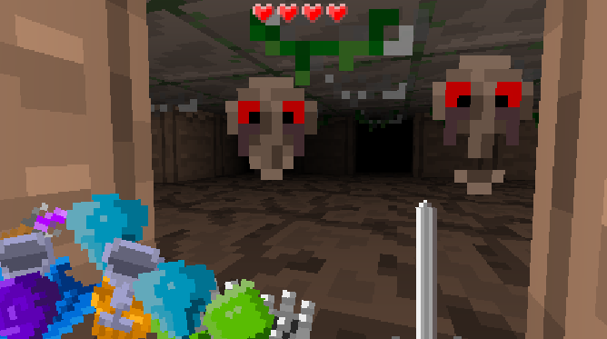
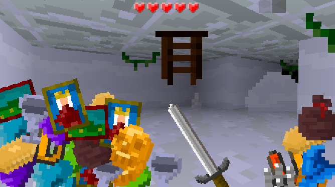

# The Burdened Raid

The Burdened Raid is a 3D retro dungeon crawler written in java using the LibGDX game development framework.
Created in less than 24h for the Ludum Dare 40 game jam competition. The game placed **29th** overall in the compo with over 1000 submissions total!

## Links

- **Play on the web** http://evgiz.net/games/theburdenedraid/
- **Ludum Dare entry** https://ldjam.com/events/ludum-dare/40/the-burdened-raid
- **Development Timelapse** https://www.youtube.com/watch?v=Z3QZ5-2dnJM
- **Playthrough video** https://www.youtube.com/watch?v=Vl0VPuhJFVI

## About the jam

The Ludum Dare game jam (compo) is a 48h game jam. All code and assets must be created within this time by one person.
This means the code may be a bit messy some places! Jamming is very rewarding however, and I would strongly recommend it to everyone!
Ludum Dare 40 was my first attemt at creating a 3D game for a jam. 

### Tools used

- **Code:** LibGDX, IntelliJ
- **Graphics:** Paint.NET
- **Audio:** BOSCA CEOIL, BFXR/SFXR, Audacity
- **Timelapse:** Chronolapse

## Can I use this?

All code is released under the MIT license. Feel free to look around if you're interested in learning Java.

## Dependencies

The Burdened Raid was written using Java and the LibGDX framework (version 1.9.7). 
Using the gradle build tool is highly recommended! IntelliJ and other IDEs with support will manage dependencies for you.

